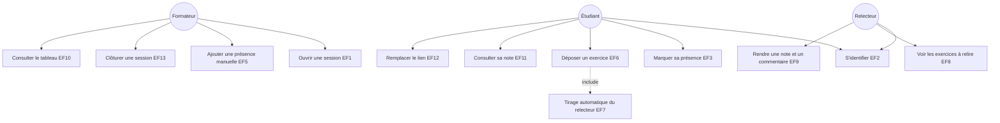

# D1 — Diagramme de cas d'utilisation

```mermaid
graph TB
    Formateur((Formateur))
    Etudiant((Étudiant))
    Relecteur((Relecteur))

    Formateur --> CU1[Ouvrir une session EF1]
    Formateur --> CU5[Ajouter une présence manuelle EF5]
    Formateur --> CU6[Clôturer une session EF13]
    Formateur --> CU7[Consulter le tableau EF10]

    Etudiant --> CU2[S'identifier EF2]
    Etudiant --> CU3[Marquer sa présence EF3]
    Etudiant --> CU4[Déposer un exercice EF6]
    Etudiant --> CU8[Consulter sa note EF11]
    Etudiant --> CU9[Remplacer le lien EF12]

    Relecteur --> CU2
    Relecteur --> CU10[Voir les exercices à relire EF8]
    Relecteur --> CU11[Rendre une note et un commentaire EF9]

    CU4 -.include.-> CU12[Tirage automatique du relecteur EF7]
```
