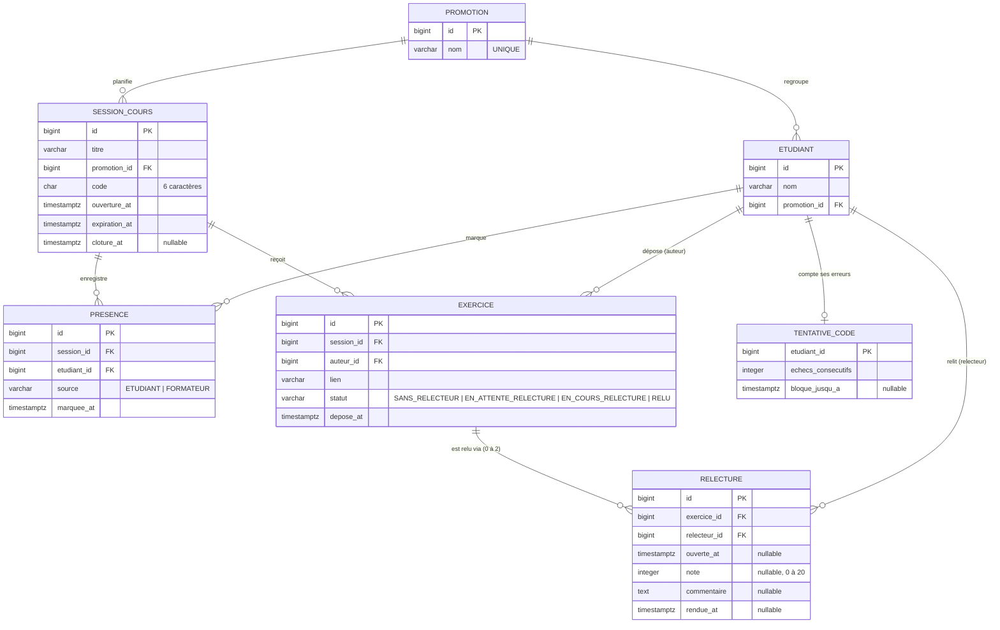

# D2 — Modèle de données

Correspond colonne par colonne aux migrations `V1__schema_initial.sql`, `V2__donnees_demo.sql` et
`db/migration/V3__DeuxRelecteurs.java`.

**Mis à jour après l'étape 3 (C2)** : un exercice a désormais jusqu'à **deux** lignes `relecture`
(une par relecteur). V3 a remplacé la contrainte `UNIQUE(exercice_id)` par
`UNIQUE(exercice_id, relecteur_id)`.

Contraintes notables :

| Table | Contrainte | Règle |
|---|---|---|
| `presence` | `UNIQUE(session_id, etudiant_id)` | RG5, ENF6 |
| `exercice` | `UNIQUE(session_id, auteur_id)` | RG9 |
| `relecture` | `UNIQUE(exercice_id, relecteur_id)` (V3, remplace `UNIQUE(exercice_id)` de V1) | RG12 v2 |
| `relecture` | `CHECK (note IS NULL OR note BETWEEN 0 AND 20)` | RG3 |

Le relecteur n'est pas une entité séparée : c'est un `etudiant`.
