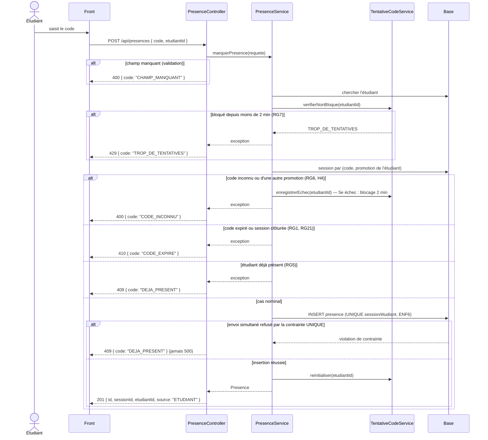

# D3 — Séquence : marquer sa présence (EF3, EF4)

Ordre des contrôles réellement implémenté dans `PresenceService.marquerPresence` (RG1, RG5, RG6,
RG7, RG21). Chaque réponse correspond au code HTTP du contrat `POST /api/presences`.

**Mis à jour à l'étape 4 (K48-11)** : le blocage après cinq codes inconnus (RG7) est vérifié
**avant** la recherche du code — sinon il ne protégerait rien — et seul un code inconnu compte
comme échec (H5).

