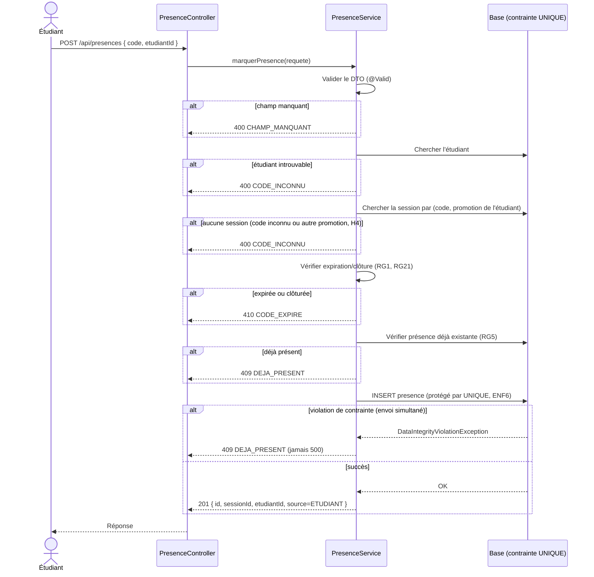

# D3 — Séquence : marquer sa présence (EF3)

Ordre des contrôles réellement implémenté dans `PresenceService.marquerPresence` (RG1, RG5, RG6, RG21).

```mermaid
sequenceDiagram
    actor E as Étudiant
    participant C as PresenceController
    participant S as PresenceService
    participant DB as Base (contrainte UNIQUE)

    E->>C: POST /api/presences { code, etudiantId }
    C->>S: marquerPresence(requete)
    S->>S: Valider le DTO (@Valid)
    alt champ manquant
        S-->>C: 400 CHAMP_MANQUANT
    end
    S->>DB: Chercher l'étudiant
    alt étudiant introuvable
        S-->>C: 400 CODE_INCONNU
    end
    S->>DB: Chercher la session par (code, promotion de l'étudiant)
    alt aucune session (code inconnu ou autre promotion, H4)
        S-->>C: 400 CODE_INCONNU
    end
    S->>S: Vérifier expiration/clôture (RG1, RG21)
    alt expirée ou clôturée
        S-->>C: 410 CODE_EXPIRE
    end
    S->>DB: Vérifier présence déjà existante (RG5)
    alt déjà présent
        S-->>C: 409 DEJA_PRESENT
    end
    S->>DB: INSERT presence (protégé par UNIQUE, ENF6)
    alt violation de contrainte (envoi simultané)
        DB-->>S: DataIntegrityViolationException
        S-->>C: 409 DEJA_PRESENT (jamais 500)
    else succès
        DB-->>S: OK
        S-->>C: 201 { id, sessionId, etudiantId, source=ETUDIANT }
    end
    C-->>E: Réponse
```
