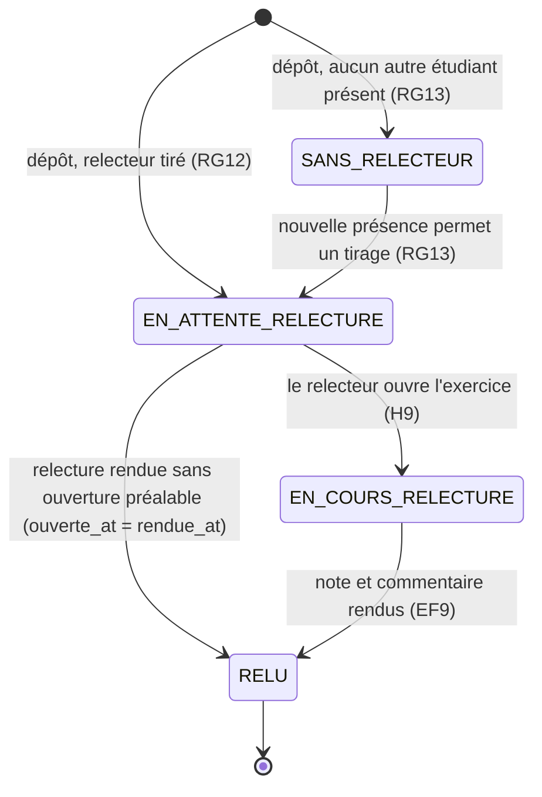

# D4 — Cycle de vie d'un exercice (bonus)

Correspond aux valeurs de `StatutExercice` (backend) et à la contrainte CHECK de `exercice.statut`.

Le remplacement du lien (EF12) n'est possible qu'en `SANS_RELECTEUR` ou `EN_ATTENTE_RELECTURE`, et
avant clôture de la session (RG16, RG20). À la clôture, l'état est figé : tout ce qui n'est pas
`RELU` compte dans `exercicesEnAttente` du tableau formateur (H12).
